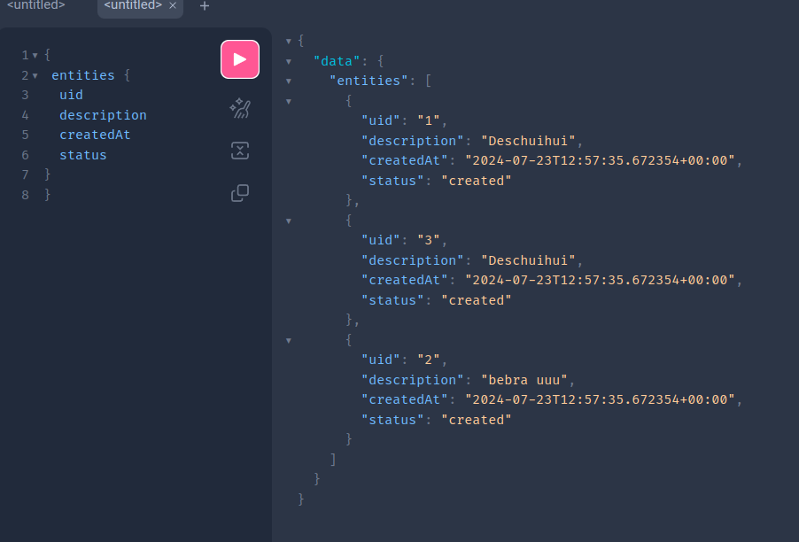

# Что сделано
 - Реализованы основные требования - возможность делать `Query` и `Mutation` к сущности `Entity` и `User`(к нему только `Query`). 
 - Для работы с базой данных был написан класс `DatabaseHandler` -  обёртка поверх SQLAlchemy, которая упрощает работу c проектом, позволяет легко его масштабировать, а так же частично разгромождающая `schema.py`. В нём реализованны методы безопасной работы с сессией SQLAlchemy(`commit()`, `execute()`), а так же макросы `insertQuery()`, `selectQuery()`
 - Все `Entity` внешним ключём связаны с каким-либо `User`. Связь ничего не даёт, но нельзя создать `Entity` ссылающееся на несуществующего `User`
 - Ошибки логируются в консоль стандартными средствами фреймворка. В опасных местах вызываются исключения, которые так же сам обрабатывает strawberry, не завершая выполнение просто скидывает ошибку в ответ на запрос. При ошибках работы с БД испорченная транзакция закрывается.
 - в `Query` данные можно фильтровать по всем необходимым полям, с помощью аргументов запроса. Для фильтрации по времени необходимо передать соответствующую структуру, описывающую фильтр.
 - Данные для подключения к БД берутся из переменных окружения
 - Вся работа с БД асинхронна. Это добавило своих костылей к `DatabaseHandler`, например необходимость создания отдельного метода - асинхронной фабрики для класса, или не очень красивая инициализация в `schema.py`. Тем не менее, всё работает **исправно**
 - `Dockerfile` исправно собирается, но не может подключиться к БД на локалхосте. Была попытка поднять БД прямо в контейнере, но мне эта идея не понравилась, так что в рамках тестового задания оставил так.

# Что не сделано
### хотя активно пыталось
- Миграции с `Alembic`. Не разобрался, ограничился просто `tables.sql`. Мог разобраться, но не хотел сдвигать срок сдачи. 
- Тесты. Была предпринята попытка написания теста, но не получилось завести его вместе со `strawberry`. Из тех же побуждений сдать раньше не стал разбираться до конца. При необходимости, тест могу скинуть(в репу заливать не стал)

